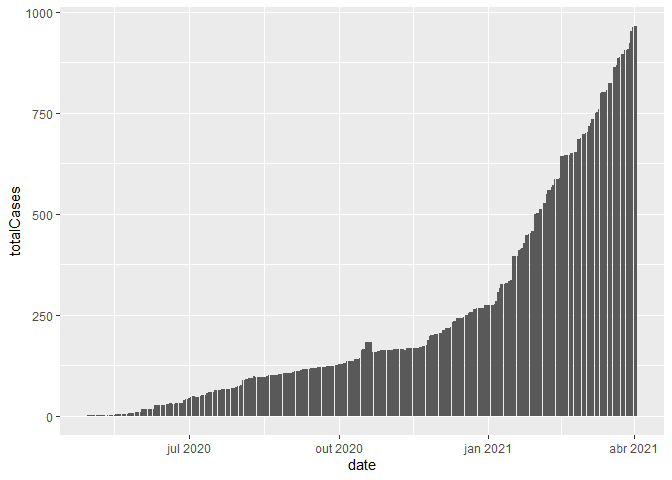

COVID-19 EM PARELHAS RN
================

## Sobre os resultados

Durante esta analise serão exibidos os graficos referentes aos novos
casos e mortes, casos totais e mortes totais ocorridos no municipio de
Parelhas/RN em decorrência do COVID-19. Havera enfase no mês de março de
2021 onde houve um grande crescimento de ocorrencias bem como no inicio
do ano de 2021.

Todos os dados utilizados foram obtidos do repositorio
[Covid19br](https://github.com/wcota/covid19br), o repositorio reune
dados das Secretarias Estaduais de Saúde e do Ministerio da Saúde.

## Graficos referentes ao periodo do inicio da pandemia ate 03/04/2021

A seguir temos o grafico dos casos acumulados ao longo de todo o periodo
de pandemia. Podemos notar um crescimento significativo a partir do fim
do ano de 2020 se prolongando durante os messes iniciais de 2021
<!-- -->

Figura 01: Grafico de casos acumulados durante o periodo de pandemia em
Parelhas/RN

## Including Code

You can include R code in the document as follows:

``` r
summary(cars)
```

    ##      speed           dist       
    ##  Min.   : 4.0   Min.   :  2.00  
    ##  1st Qu.:12.0   1st Qu.: 26.00  
    ##  Median :15.0   Median : 36.00  
    ##  Mean   :15.4   Mean   : 42.98  
    ##  3rd Qu.:19.0   3rd Qu.: 56.00  
    ##  Max.   :25.0   Max.   :120.00

## Including Plots

You can also embed plots, for example:

<!-- -->

Note that the `echo = FALSE` parameter was added to the code chunk to
prevent printing of the R code that generated the plot.
