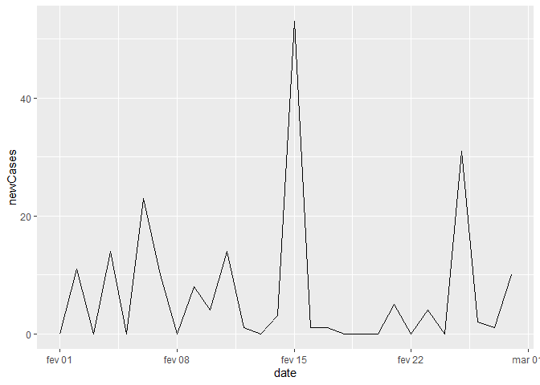

COVID-19 EM PARELHAS RN
================

## Sobre os resultados

Durante esta análise serão exibidos os gráficos referentes aos novos
casos e mortes, casos totais e mortes totais ocorridos no município de
Parelhas/RN em decorrência do COVID-19. Haverá ênfase no mês de março de
2021 onde houve um grande crescimento de ocorrências bem como no início
do ano de 2021.

### Sobre a fonte dos dados

Todos os dados utilizados foram obtidos do repositório
[Covid19br](https://github.com/wcota/covid19br), o repositório reúne
dados das Secretarias Estaduais de Saúde e do Ministério da Saúde.

## Gráficos referentes ao periodo do inicio da pandemia ate 03/04/2021

A seguir temos o gráfico dos casos acumulados ao longo de todo o período
de pandemia. Podemos notar um crescimento significativo a partir do fim
do ano de 2020 se prolongando durante os meses iniciais de 2021.

> Gráfico 01: Casos acumulados durante o período de pandemia em
> Parelhas/RN até 03/04/2021

<!-- -->

A seguir temos o gráfico do acumulo de mortes causadas por COVID-19
durante o ano de 2020 até 03/04/2021.

> Gráfico 02: Óbitos acumulados durante o período de pandemia em
> Parelhas/RN até 03/04/2021

<!-- -->

É possível notar um crescimento considerável de vítimas no mês de março
de 2021.No próximo gráfico podemos ver a frequência de novos casos no
município de parelhas durante todo o período da pandemia até 03/04/2021.

> Gráfico 03: Novos casos durante o período da pandemia em Parelhas/RN

<!-- -->

Podemos notar que o ano de 2021, apesar de ainda estar no seu primeiro
semestre, apresenta uma frequência de casos superior a todo o ano de
2020. A seguir é mostrado o recorte do gráfico por anos, sendo os novos
casos durante 2020 e os novos casos durante o período de 01/01 a 03/04
de 2021.

> Gráfico 04: Novos casos durante o período da pandemia no ano de 2020
> em Parelhas/RN

<!-- -->

Podemos notar por meio do gráfico que houve um pico de novos casos
próximo ao fim do ano de 2020. Abaixo temos o gráfico de 2021.

> Gráfico 05: Novos casos durante o ano de 2021 em Parelhas/RN

<!-- -->

## Recorte sobre os meses de Fevereiro e Março de 2021

Pode-se ver nos gráficos a seguir os dados referentes a novos casos nos
meses de Fevereiro e Março de 2021.

No gráfico a seguir, referente a Fevereiro, podemos notar um grande pico
de novos casos aproximadamente no meio do mês.

> Gráfico 06: Novos casos durante o mês de Fevereiro de 2021 em
> Parelhas/RN

<!-- -->

Já no gráfico a seguir, referente a Março de 2021, podemos notar uma
frequência de novos casos bem como uma ocorrência maior de casos por
dia.

> Gráfico 07: Novos casos durante o mês de Março de 2021 em Parelhas/RN

<!-- -->

Junto com a crescente de novos casos registrado ocorreu também o aumento
de óbitos, durante o ano de 2021 podemos ver, por meio do gráfico
abaixo, que em sua grande maioria os óbitos se concentraram no mês de
Março.

> Gráfico 08: Novos óbitos de 01/01 a 03/04 de 2021 em Parelhas/RN

<!-- -->

No gráfico a seguir podemos ver um recorte apenas do mês de março
referente aos novos óbitos no município de parelhas.

> Gráfico 09: Novos óbitos durante o mês de Março de 2021 em Parelhas/RN

<!-- -->

## Nível Nacional

Observando o gráfico abaixo, podemos ver a frequência de novos casos de
COVID-19 em todo o território brasileiro, e notar, que não só Parelhas
enfrenta uma nova onda de contaminações como todo o país. Podemos notar
também, que como em Parelhas, a nova onda é maior que a anterior.

> Gráfico 10: Novos casos no Brasil desde o início da pandemia do
> COVID-19 no país até a data de 03/04/2021

<!-- -->

## Considerações finais

A crescente de novos casos no município de Parelhas/RN não é uma
exclusividade da região, ocorrendo também em nível nacional. Essa nova
crescente pode estar associada a variante brasileira do coronavirus bem
como o menor isolamento social pelo qual o país passa.

Focando em Parelhas, o aumento de casos pode estar também associado a
maior testagem feita por o município, o que acarreta uma maior
visualização da situação da pandemia no município.

### Observações importantes

Os dados fornecidos por o MS e a SES diferem dos do boletim informativo
da Prefeitura Municipal de Parelhas, essa diferença de dados ocorre com
TODOS os municípios não sendo um fato exclusivo de Parelhas. Ocorre
também um atraso nas atualizações dos dados por a SES e o MS podendo os
números dos dias não combinarem exatamente com os do boletim municipal.
Apesar disso os dados são uteis e validos para se ter dimensão da
situação atual da pandemia no município.
